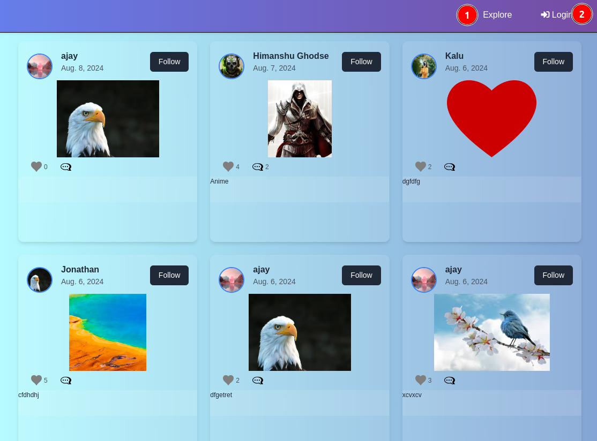
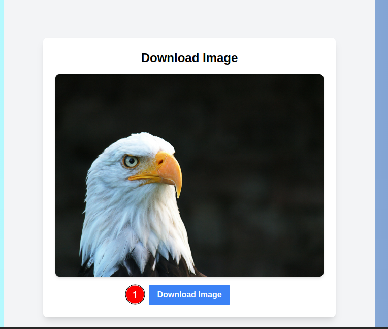
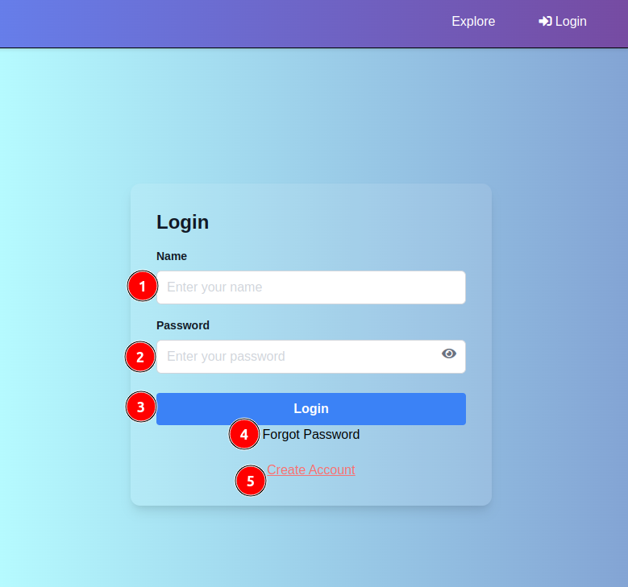
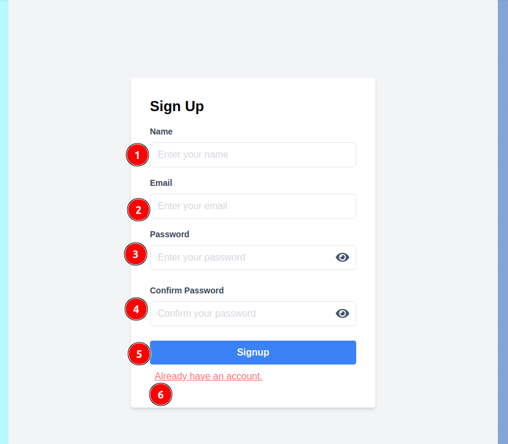

# User Guide 

When a user visits the website URL, they will see the following page.

  1.  **Explore** :This is the default home page. The user will be redirected on this page if they are not authenticated.

### If Not authenticated
   * When clicking on the like button, comments, or follow button, the user will be redirected to the login page.
   * When clicks on the image user will be redirectyed to the following page mentioned below : 

#### Download image :
   1.**Download Image** : By clicking on the download image button user can download the current image.
  2. **Login** : By clicking on the login buttom, following page would be appear :

# Login Page
Now you are on the login page 

### If already have an account

1. **Name** : Enter your registered name.
2. **Password** : You need to enter the password you chose during registration.
3. **Login** : By clicking the login button, you will be redirected to the home page.
4. **Forgot Password** : By clicking this, you can reset your password.
5. **Create Account** : By clicking on this link you will be redirected to the following account creation page mentioned below : 

# Sign Up Page
1. **Name** : You can enter a unique username that contains alphabets, digits, or special characters such as !, @, #, $ etc.
2. **Email** : Enter your unique, valid email ID to create an account.
3. **Password** : Enter a password to create an account.
4. **Confirm Password** : Re-enter your password.
5. **Sign Up** : Click to create account, and you will be redirected to the login page (mentioned above).
6. **Already have an account** : Use this link if you already have an account.